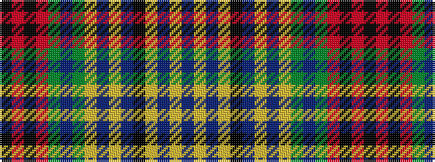

BYBYKBYBYGBGRKRK

It is a 16 stripe tartan.

<figure class="pat-woven">

<figcaption>idealised sample</figcaption>
</figure>

## Colour Sequence



## Tartans with this colour sequence

| Tartans |
|---------------|
| [Huntly Old](/tartans/n16lr2dr7lr2k14b6lr2n15lr2dg17b6dg6r8k6r8k2/)|
||
