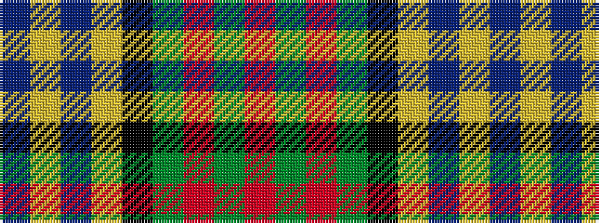

BYBYKGRGR

It is a 9 stripe tartan.

<figure class="pat-woven">

<figcaption>idealised sample</figcaption>
</figure>

## Colour Sequence



## Tartans with this colour sequence

| Tartans |
|---------------|
| [MacMillan Hunting](/variants/s9/db10ly3db30ly5k8dg16r4dg16r2~x2/)|
||
| [MacMillan, hunting](/variants/s9/db10ly3db30ly5k8g16r4g16r2~x2/)|
||
