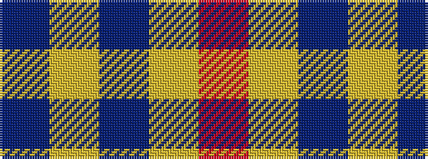

BYBYR

It is a 5 stripe tartan.

<figure class="pat-woven">

<figcaption>idealised sample</figcaption>
</figure>

## Colour Sequence



## Tartans with this colour sequence

| Tartans |
|---------------|
| [Brooks Brothers Tattersall Camel](/setts/s5/db1lo9db2lo9r1~x4/)|
||
