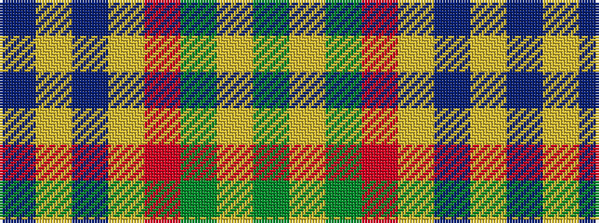

BYBYRGYG

It is a 8 stripe tartan.

<figure class="pat-woven">

<figcaption>idealised sample</figcaption>
</figure>

## Colour Sequence



## Tartans with this colour sequence

| Tartans |
|---------------|
| [Slessor (Personal)](/variants/s8/dg2lo1dg11r50lo12db2lo4db2~x2/)|
||
