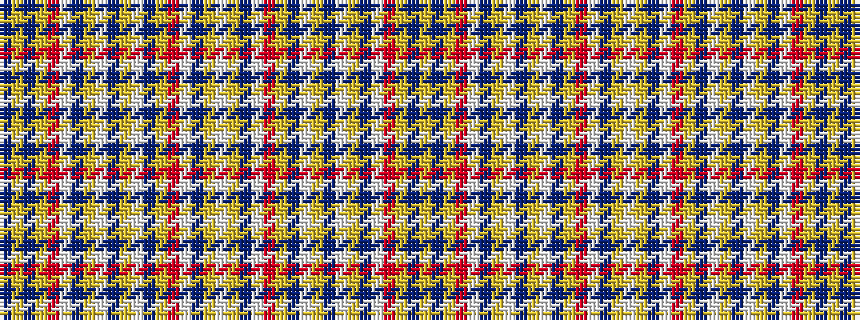

BYBYRWBYWBYWBYRWBYWYBWRYBWYBWYBWRYBY

It is a 36 stripe tartan.

<figure class="pat-woven">

<figcaption>idealised sample</figcaption>
</figure>

## Colour Sequence



## Tartans with this colour sequence

| Tartans |
|---------------|
| [Racing Wanless Australian Corporate Tartan](/variants/s36/db25ly5db12ly3r1w1db12ly3w1db12ly3w1db12ly5r1w1db12ly4w2~x2/)|
||
