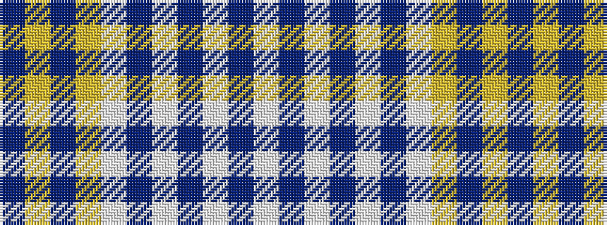

BYBYWBWBWBW

It is a 11 stripe tartan.

<figure class="pat-woven">

<figcaption>idealised sample</figcaption>
</figure>

## Colour Sequence



## Tartans with this colour sequence

| Tartans |
|---------------|
| [Dunn](/setts/s11/n45lo6n3lo6lb3dp5lb3dp5lb20n2lb3~x2/)|
||
