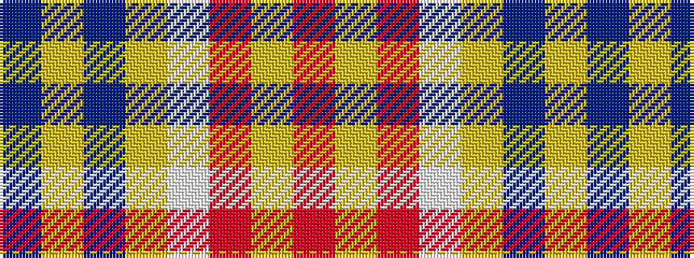

BYBYWRYR

It is a 8 stripe tartan.

<figure class="pat-woven">

<figcaption>idealised sample</figcaption>
</figure>

## Colour Sequence



## Tartans with this colour sequence

| Tartans |
|---------------|
| [Bannockbane](/variants/s8/dr2lo2dr15lo1w10o15lo2o2~x2/)|
||
