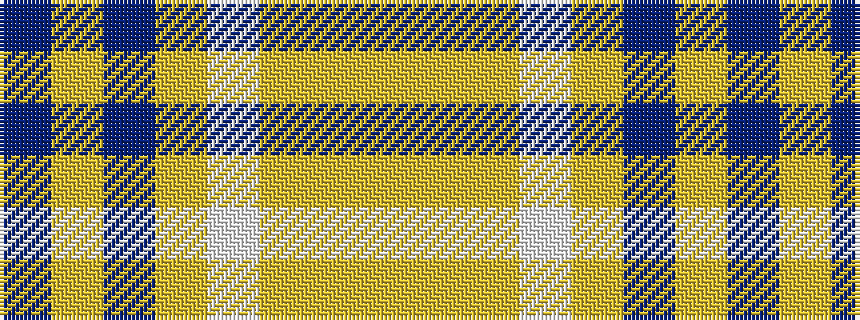

BYBYWYYY

It is a 8 stripe tartan.

<figure class="pat-woven">

<figcaption>idealised sample</figcaption>
</figure>

## Colour Sequence



## Tartans with this colour sequence

| Tartans |
|---------------|
| [Bannockbane Green](/variants/s8/dt3loi2dt30loi1w18lg30lo2lg3~x2/)|
||
| [Bannockbane Orange Stripes](/variants/s8/do2lo2do15lo1w10loi15lo2loi2~x2/)|
||
