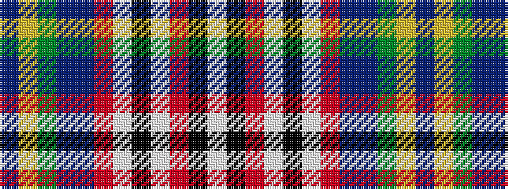

BYGBBRWKWRKW

It is a 12 stripe tartan.

<figure class="pat-woven">

<figcaption>idealised sample</figcaption>
</figure>

## Colour Sequence



## Tartans with this colour sequence

| Tartans |
|---------------|
| [Queen Mary, RMS](/setts/s12/db24ly4y4p4db24r4w3k18w9r4k3w2~x2/)|
||
