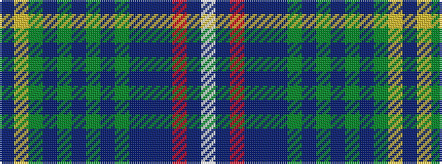

BYGBGBGBGBBBRBW

It is a 15 stripe tartan.

<figure class="pat-woven">

<figcaption>idealised sample</figcaption>
</figure>

## Colour Sequence



## Tartans with this colour sequence

| Tartans |
|---------------|
| [MatchPoint Dress](/variants/s15/t6lo2y24t4y8t6y6t8y3t10n14t4r3t34w4/)|
||
| [Matchpoint Hunting](/variants/s15/db6ly2g24db4g8db6g6db8g3db10n14db4r3db34lb4/)|
||
| [Matchpoint Hunting](/variants/s15/b6lo2dy24b4dy8b6dy6b8dy3b10n14b4r3b34w4/)|
||
