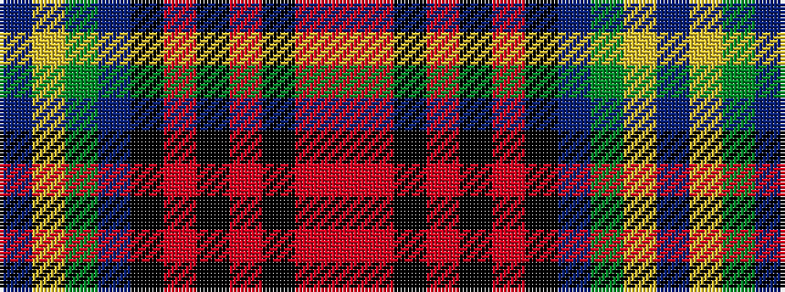

BYGBKRKRKRR

It is a 11 stripe tartan.

<figure class="pat-woven">

<figcaption>idealised sample</figcaption>
</figure>

## Colour Sequence



## Tartans with this colour sequence

| Tartans |
|---------------|
| [Blais (Personal)](/tartans/db20ly1dy1db3k1o2k1r10k1o2r4/)|
||
