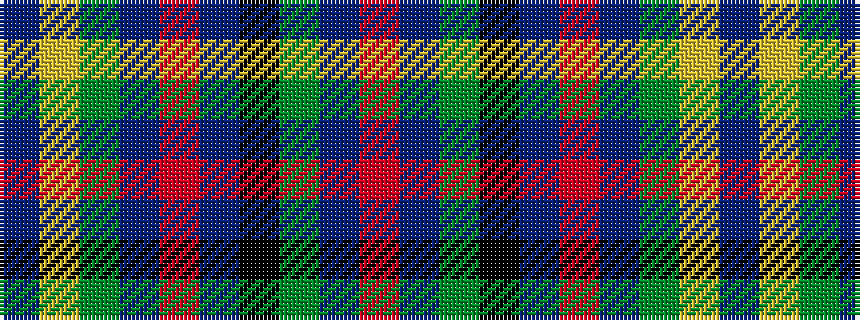

BYGBRBKGBR

It is a 10 stripe tartan.

<figure class="pat-woven">

<figcaption>idealised sample</figcaption>
</figure>

## Colour Sequence



## Tartans with this colour sequence

| Tartans |
|---------------|
| [State Seal of Arkansas (Fashion)](/setts/s10/dt49lo3dy13dt12r4dt5k7y26dt4r2~x2/)|
||
