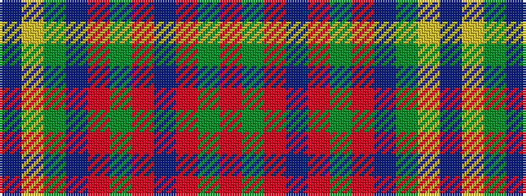

BYGBRGRBRGR

It is a 11 stripe tartan.

<figure class="pat-woven">

<figcaption>idealised sample</figcaption>
</figure>

## Colour Sequence



## Tartans with this colour sequence

| Tartans |
|---------------|
| [Cadden-Phillips (Personal)](/setts/s11/r40dg2r2dp2r2g2r2dr5dg20ly2dp20~x2/)|
||
