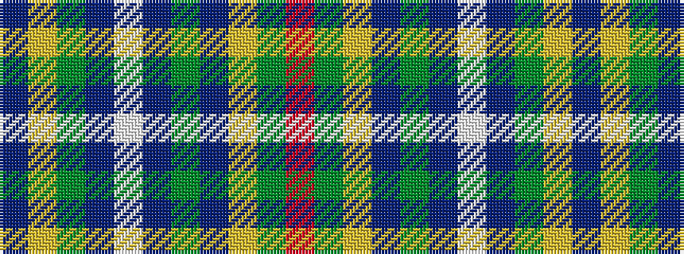

BYGBWBGBYGR

It is a 11 stripe tartan.

<figure class="pat-woven">

<figcaption>idealised sample</figcaption>
</figure>

## Colour Sequence



## Tartans with this colour sequence

| Tartans |
|---------------|
| [Saltcoats (Saskatchewan)](/setts/s11/db3ly3y15b8w8db6y15b6ly3dg6r3~x2/)|
||
