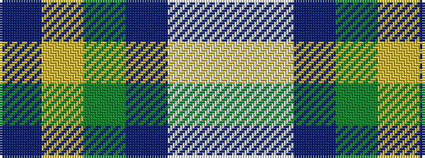

BYGBWW

It is a 6 stripe tartan.

<figure class="pat-woven">

<figcaption>idealised sample</figcaption>
</figure>

## Colour Sequence



## Tartans with this colour sequence

| Tartans |
|---------------|
| [Heriot Bay Local (Quadra Island, British Columbia)](/setts/s6/ti5lr2g4t3w1lb5~x8/)|
||
