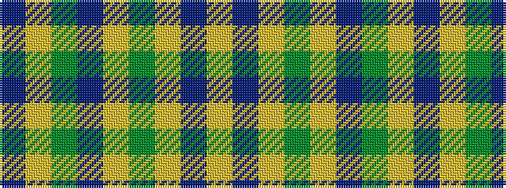

BYGBYGYBY

It is a 9 stripe tartan.

<figure class="pat-woven">

<figcaption>idealised sample</figcaption>
</figure>

## Colour Sequence



## Tartans with this colour sequence

| Tartans |
|---------------|
| [Land's End Camel](/setts/s9/lo24do2lo3dy6lo3do2dg15lo20do4~x2/)|
||
