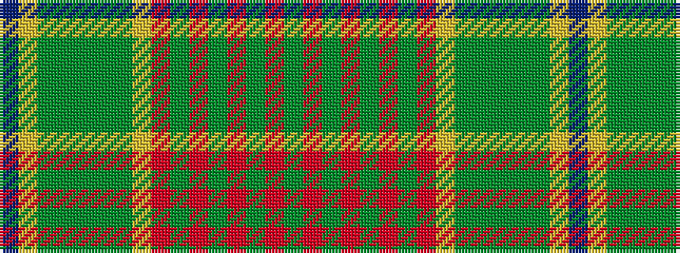

BYGGGGGYRGRGRGRG

It is a 16 stripe tartan.

<figure class="pat-woven">

<figcaption>idealised sample</figcaption>
</figure>

## Colour Sequence



## Tartans with this colour sequence

| Tartans |
|---------------|
| [Dixon, Clyde (Personal)](/setts/s16/t2ly1dgi2dg8dgi8y9dgi3ly2r1y1r1y1r1y1r1y1~x2/)|
||
