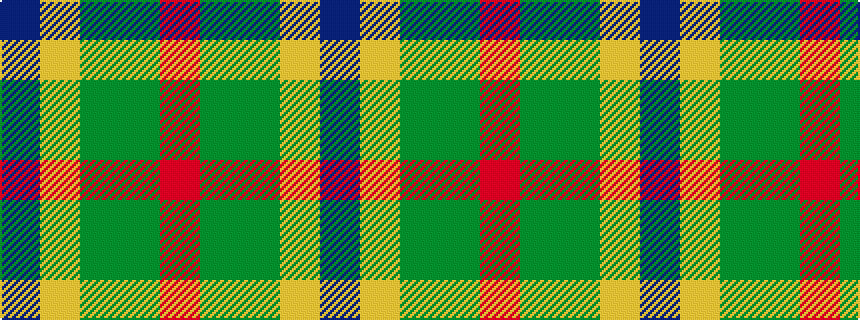

BYGGR

It is a 5 stripe tartan.

<figure class="pat-woven">

<figcaption>idealised sample</figcaption>
</figure>

## Colour Sequence



## Tartans with this colour sequence

| Tartans |
|---------------|
| [Clare (Prince George) (Personal)](/variants/s5/dp5lo5dy13g41r3~x2/)|
||
| [Clare, Richard (Personal)](/variants/s5/dt5lo5dy13g41r3~x2/)|
||
