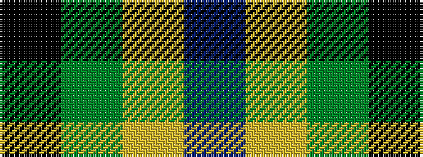

BYGK

It is a 4 stripe tartan.

<figure class="pat-woven">

<figcaption>idealised sample</figcaption>
</figure>

## Colour Sequence



## Tartans with this colour sequence

| Tartans |
|---------------|
| [Thistle and Kudzu Scottish Socie Corporate Tartan](/variants/s4/p6lg15g15k2~x2/)|
||
