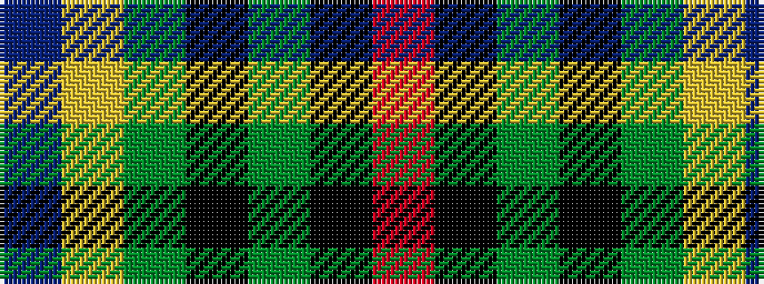

BYGKGKR

It is a 7 stripe tartan.

<figure class="pat-woven">

<figcaption>idealised sample</figcaption>
</figure>

## Colour Sequence



## Tartans with this colour sequence

| Tartans |
|---------------|
| [PMMC](/setts/s7/r3k11dg29k28g19ly2b1~x2/)|
||
| [PMMC](/setts/s7/r3k11gi29k28g19ly2db1~x2/)|
||
