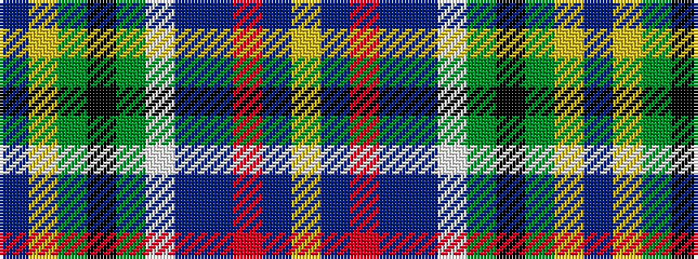

BYGKGWBBRBY

It is a 11 stripe tartan.

<figure class="pat-woven">

<figcaption>idealised sample</figcaption>
</figure>

## Colour Sequence



## Tartans with this colour sequence

| Tartans |
|---------------|
| [Allison](/setts/s11/db64ly3g12k3g12w3db15db4r21db3ly2/)|
||
| [Allison (1882)](/setts/s11/db64ly3dg12k3dg12w3db15db4r21db3ly2/)|
||
