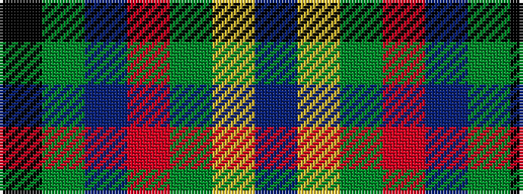

BYGRBGK

It is a 7 stripe tartan.

<figure class="pat-woven">

<figcaption>idealised sample</figcaption>
</figure>

## Colour Sequence



## Tartans with this colour sequence

| Tartans |
|---------------|
| [Mayo](/setts/s7/k4g16db11r16g25ly2t3~x2/)|
||
| [Mayo, County (District)](/setts/s7/k4dg16db11r16dg25lo2t3~x2/)|
||
