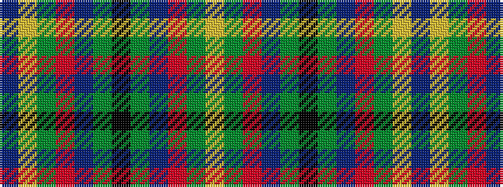

BYGRBGKGBRGY

It is a 12 stripe tartan.

<figure class="pat-woven">

<figcaption>idealised sample</figcaption>
</figure>

## Colour Sequence



## Tartans with this colour sequence

| Tartans |
|---------------|
| [Mayo, County](/variants/s12/k4dg16db11r16dg25lo2t3~x2/)|
||
