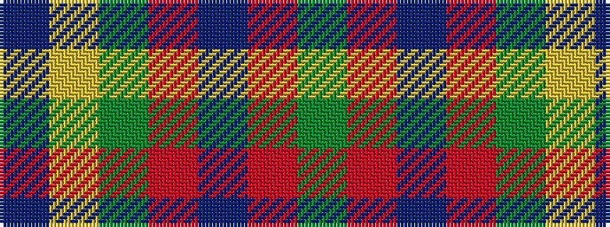

BYGRBRG

It is a 7 stripe tartan.

<figure class="pat-woven">

<figcaption>idealised sample</figcaption>
</figure>

## Colour Sequence



## Tartans with this colour sequence

| Tartans |
|---------------|
| [Rotary](/variants/s7/g25r4db25r13g25ly2t6~x2/)|
||
| [Rotary Corporate Tartan](/variants/s7/y19r3t19r11y19ly2db4~x2/)|
||
| [Rotary International](/variants/s7/g15r3t15r8g15ly2db4~x2/)|
||
