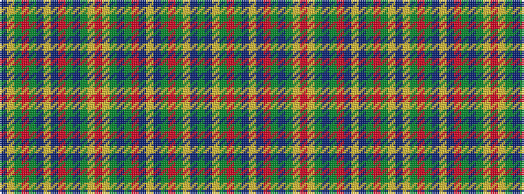

BYGRGBYBRGBGYRYGBGRBYBGRGYBG

It is a 28 stripe tartan.

<figure class="pat-woven">

<figcaption>idealised sample</figcaption>
</figure>

## Colour Sequence



## Tartans with this colour sequence

| Tartans |
|---------------|
| [Platt (Name)](/setts/s28/g16db6ly2g12r2g14db14ly1db12r2g6db24g6ly2r2~x2/)|
||
