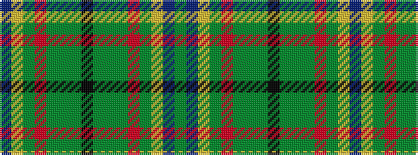

BYGRGGGKGGGRGYBG

It is a 16 stripe tartan.

<figure class="pat-woven">

<figcaption>idealised sample</figcaption>
</figure>

## Colour Sequence



## Tartans with this colour sequence

| Tartans |
|---------------|
| [Connemarra Irish District Tartan](/variants/s16/t4ly1g1r30g18g3g1k3g1g3g18r30g1ly1t4g2~x2/)|
||
