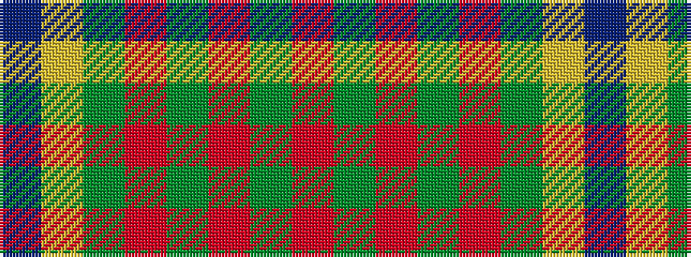

BYGRGRGR

It is a 8 stripe tartan.

<figure class="pat-woven">

<figcaption>idealised sample</figcaption>
</figure>

## Colour Sequence



## Tartans with this colour sequence

| Tartans |
|---------------|
| [Indiana "Cardinal" (District)](/variants/s8/db8lo1g12r10y2r6y2r4~x4/)|
||
