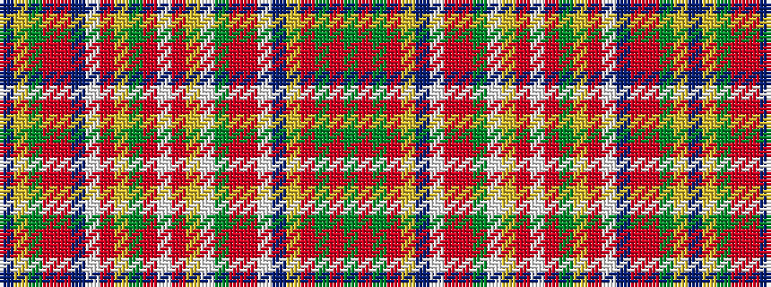

BYGRRBWRYGRWRYWGRRWBYRGRG

It is a 25 stripe tartan.

<figure class="pat-woven">

<figcaption>idealised sample</figcaption>
</figure>

## Colour Sequence



## Tartans with this colour sequence

| Tartans |
|---------------|
| [Wirth, Iwan (Personal)](/variants/s25/do96lr40dg8o13r1do13w4ri5lr10dg39o15w18ri3lo1w22dg14o8ri5w4do13lo1o8dg8o40dg14/)|
||
