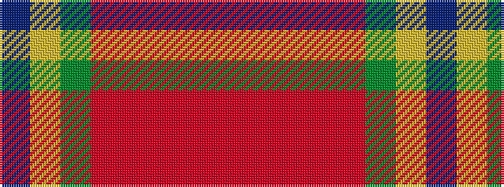

BYGRRRRR

It is a 8 stripe tartan.

<figure class="pat-woven">

<figcaption>idealised sample</figcaption>
</figure>

## Colour Sequence



## Tartans with this colour sequence

| Tartans |
|---------------|
| [Indiana "Cardinal"](/variants/s8/db8ly1dg12r10o2r6o2r4~x4/)|
||
