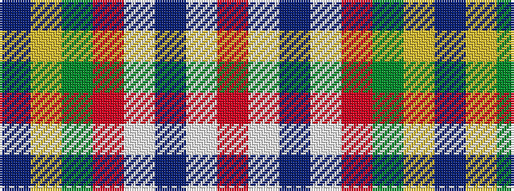

BYGRWBWR

It is a 8 stripe tartan.

<figure class="pat-woven">

<figcaption>idealised sample</figcaption>
</figure>

## Colour Sequence



## Tartans with this colour sequence

| Tartans |
|---------------|
| [Legion of Frontiersmen](/variants/s8/do62ly7g7r3w3db13w3r5~x2/)|
||
| [Legion of Frontiersmen](/variants/s8/dr62ly7g7r3w3db13w3r5~x2/)|
||
