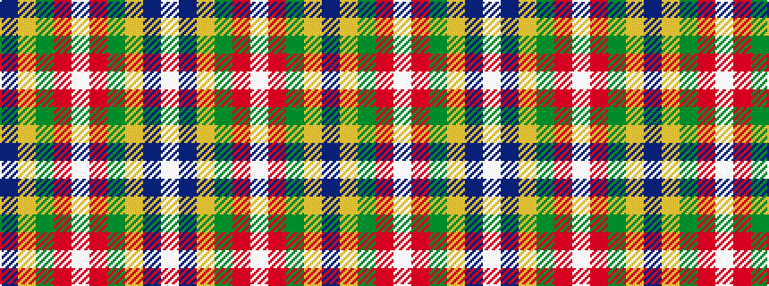

BYGRWRGYBW

It is a 10 stripe tartan.

<figure class="pat-woven">

<figcaption>idealised sample</figcaption>
</figure>

## Colour Sequence



## Tartans with this colour sequence

| Tartans |
|---------------|
| [International Pairs (Corporate)](/variants/s10/db34lo6g6r2w2r2g10lo8db23w2~x2/)|
||
