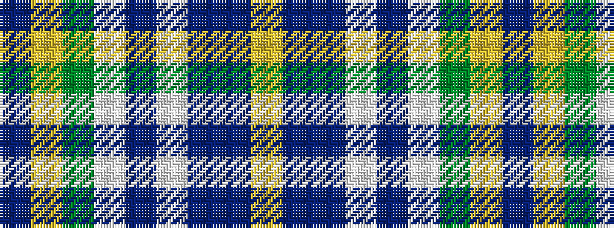

BYGWBWBBY

It is a 9 stripe tartan.

<figure class="pat-woven">

<figcaption>idealised sample</figcaption>
</figure>

## Colour Sequence



## Tartans with this colour sequence

| Tartans |
|---------------|
| [Yule (Name)](/setts/s9/t1ly3g14w2db22w2dp14t3ly1~x2/)|
||
