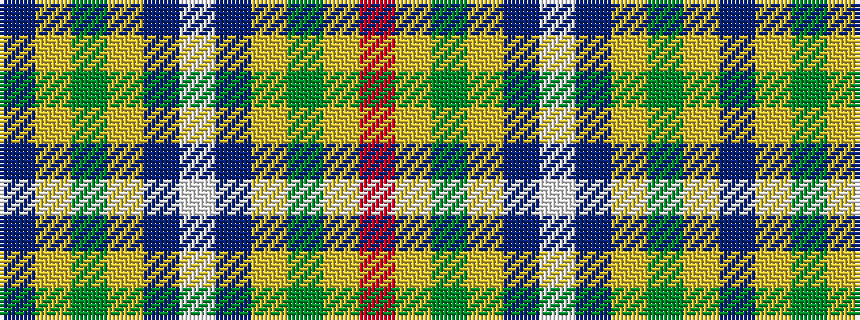

BYGYBWBYGYR

It is a 11 stripe tartan.

<figure class="pat-woven">

<figcaption>idealised sample</figcaption>
</figure>

## Colour Sequence



## Tartans with this colour sequence

| Tartans |
|---------------|
| [MacKessog](/setts/s11/n1lo8dy2lo2db6w1db6lo2dy2lo8r1~x4/)|
||
