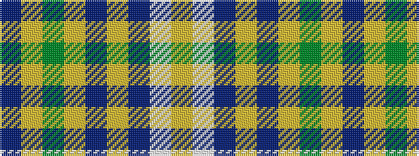

BYGYBYBWY

It is a 9 stripe tartan.

<figure class="pat-woven">

<figcaption>idealised sample</figcaption>
</figure>

## Colour Sequence



## Tartans with this colour sequence

| Tartans |
|---------------|
| [Edmonton, City of](/setts/s9/t8ly2g4ly2dp4ly2t8w15lo2~x4/)|
||
