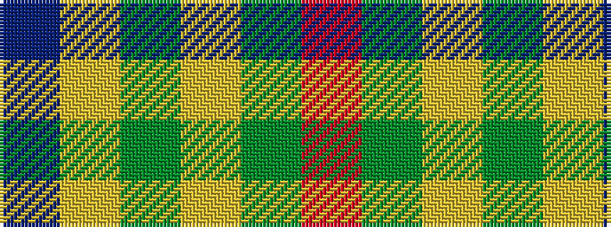

BYGYGR

It is a 6 stripe tartan.

<figure class="pat-woven">

<figcaption>idealised sample</figcaption>
</figure>

## Colour Sequence



## Tartans with this colour sequence

| Tartans |
|---------------|
| [Balfour](/setts/s6/db30ly3dy11ly3y33r6~x2/)|
||
| [Balfour #2](/tartans/db18ly2dy6ly2dy19r3/)|
||
| [Balfour Hunting](/setts/s6/b30ly3dy11ly3g33r6~x2/)|
||
