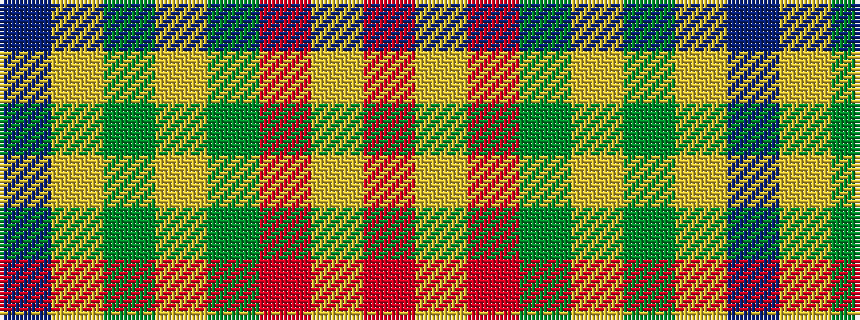

BYGYGRYR

It is a 8 stripe tartan.

<figure class="pat-woven">

<figcaption>idealised sample</figcaption>
</figure>

## Colour Sequence



## Tartans with this colour sequence

| Tartans |
|---------------|
| [Alegre-Wood (Personal)](/setts/s8/r80lo2r6dy12lo1dy1lo2b2~x2/)|
||
