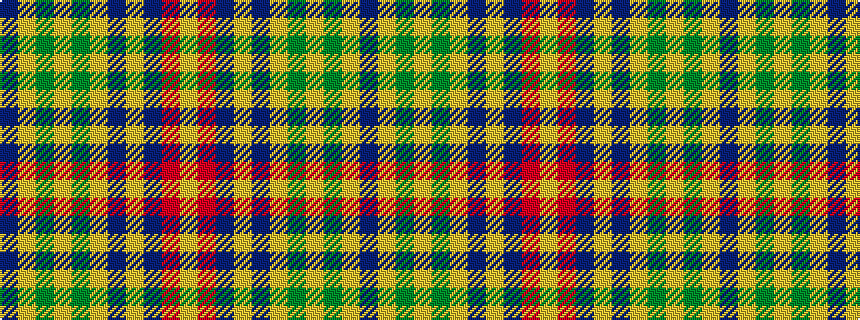

BYGYGYBYBRY

It is a 11 stripe tartan.

<figure class="pat-woven">

<figcaption>idealised sample</figcaption>
</figure>

## Colour Sequence



## Tartans with this colour sequence

| Tartans |
|---------------|
| [Craven County (Commemorative)](/variants/s11/b46ly1dy5ly1g5ly1dp5ly1b16r1ly4~x2/)|
||
