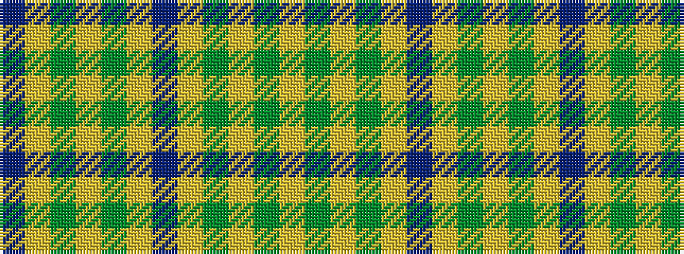

BYGYGYBYGYGY

It is a 12 stripe tartan.

<figure class="pat-woven">

<figcaption>idealised sample</figcaption>
</figure>

## Colour Sequence



## Tartans with this colour sequence

| Tartans |
|---------------|
| [Lewis of Wales](/setts/s12/db56lo2dg19lo1dg2lo1db2~x2/)|
||
