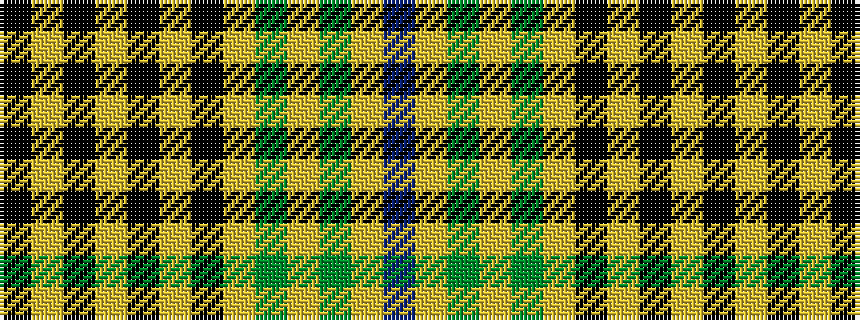

BYGYGYKYKYKYK

It is a 13 stripe tartan.

<figure class="pat-woven">

<figcaption>idealised sample</figcaption>
</figure>

## Colour Sequence



## Tartans with this colour sequence

| Tartans |
|---------------|
| [Saunders (Personal)](/setts/s13/k1ly1k1ly1k1ly1k1ly1y46lr17y4lr16dr1~x2/)|
||
