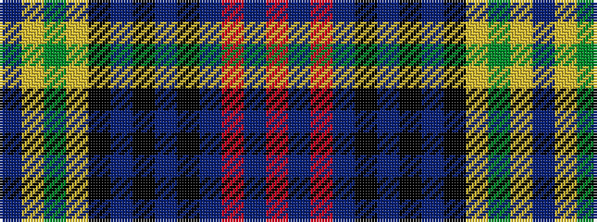

BYGYKBKBKBRBR

It is a 13 stripe tartan.

<figure class="pat-woven">

<figcaption>idealised sample</figcaption>
</figure>

## Colour Sequence



## Tartans with this colour sequence

| Tartans |
|---------------|
| [Baron of Greencastle Htg (Personal)](/setts/s13/db4ly2g24ly2k12db3k2db2k2db14r1db1r3~x2/)|
||
