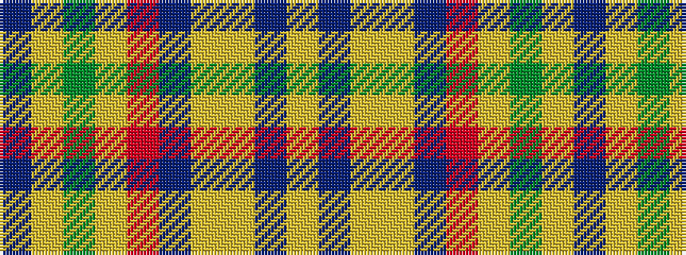

BYGYRBYYBY

It is a 10 stripe tartan.

<figure class="pat-woven">

<figcaption>idealised sample</figcaption>
</figure>

## Colour Sequence



## Tartans with this colour sequence

| Tartans |
|---------------|
| [Satisfashion Argyll (Corporate)](/setts/s10/do5lo1y27lo9r6do5lo1lo23do3lo5~x2/)|
||
