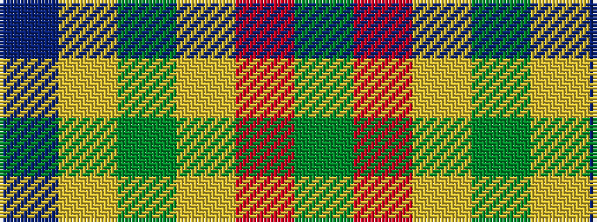

BYGYRG

It is a 6 stripe tartan.

<figure class="pat-woven">

<figcaption>idealised sample</figcaption>
</figure>

## Colour Sequence



## Tartans with this colour sequence

| Tartans |
|---------------|
| [McCabe (2016)](/setts/s6/db8ly1dg5ly12r1dg2~x6/)|
||
