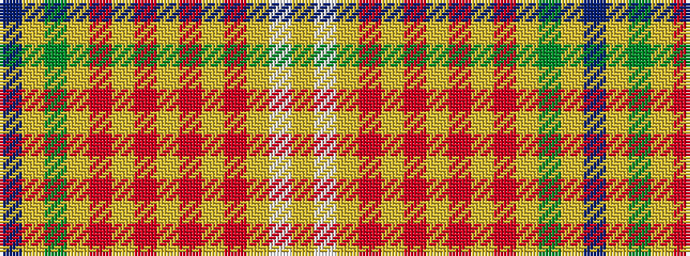

BYGYRYRYRYRYWY

It is a 14 stripe tartan.

<figure class="pat-woven">

<figcaption>idealised sample</figcaption>
</figure>

## Colour Sequence



## Tartans with this colour sequence

| Tartans |
|---------------|
| [Catalan](/setts/s14/db3ly3g3ly62r9ly9r9ly9r9ly9r9ly62w3ly3/)|
||
