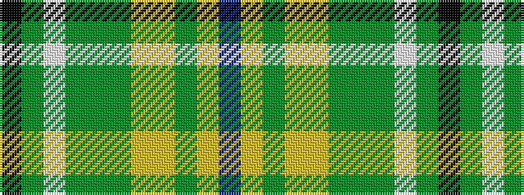

BYGYYGGGWGK

It is a 11 stripe tartan.

<figure class="pat-woven">

<figcaption>idealised sample</figcaption>
</figure>

## Colour Sequence



## Tartans with this colour sequence

| Tartans |
|---------------|
| [State Seal of Wyoming (Fashion)](/setts/s11/k49dy15lb2dy6g6dy16lo3lo23dy9lo2b9~x2/)|
||
