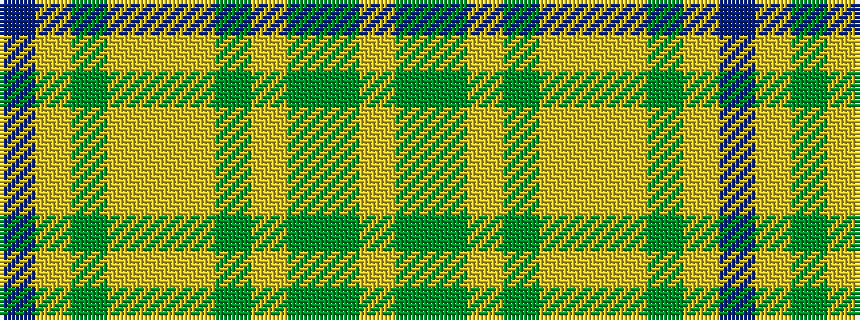

BYGYYYGYGGY

It is a 11 stripe tartan.

<figure class="pat-woven">

<figcaption>idealised sample</figcaption>
</figure>

## Colour Sequence



## Tartans with this colour sequence

| Tartans |
|---------------|
| [Annand Family (Personal)](/setts/s11/dp4loi8g2loi2lo2loi2g2loi2dy6g10loi3~x2/)|
||
