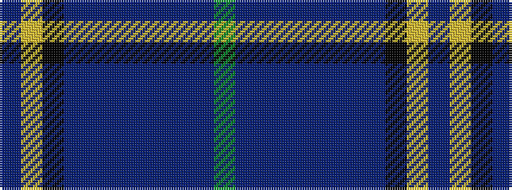

BYKBBBBBBBG

It is a 11 stripe tartan.

<figure class="pat-woven">

<figcaption>idealised sample</figcaption>
</figure>

## Colour Sequence



## Tartans with this colour sequence

| Tartans |
|---------------|
| [Smith Family (Maine) (Personal)](/setts/s11/g2db2t23db2t2db6t2db2k33ly2t2~x2/)|
||
