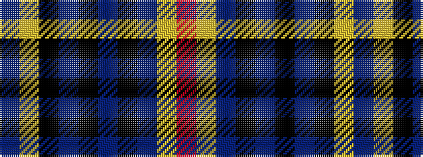

BYKBKBKBYR

It is a 10 stripe tartan.

<figure class="pat-woven">

<figcaption>idealised sample</figcaption>
</figure>

## Colour Sequence



## Tartans with this colour sequence

| Tartans |
|---------------|
| [KPMG (Corporate)](/setts/s10/r12lo2db3k3db30k20dr6k10lo2dr4~x2/)|
||
