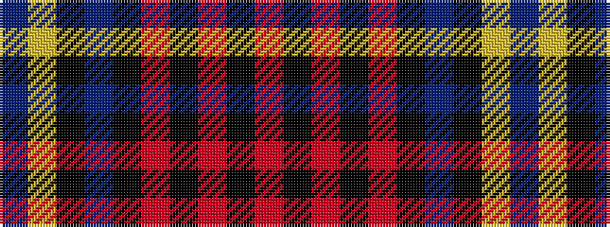

BYKBKRKRKR

It is a 10 stripe tartan.

<figure class="pat-woven">

<figcaption>idealised sample</figcaption>
</figure>

## Colour Sequence



## Tartans with this colour sequence

| Tartans |
|---------------|
| [Campbell 'Camel'](/setts/s10/do1lr2k5do3k1o4k1o10k1o1~x4/)|
||
