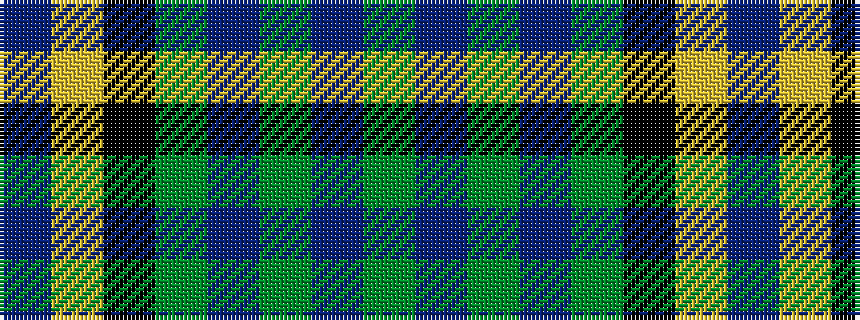

BYKGBGBG

It is a 8 stripe tartan.

<figure class="pat-woven">

<figcaption>idealised sample</figcaption>
</figure>

## Colour Sequence



## Tartans with this colour sequence

| Tartans |
|---------------|
| [Lemania](/variants/s8/g12db3g3db3g3k15lg20b3~x2/)|
||
