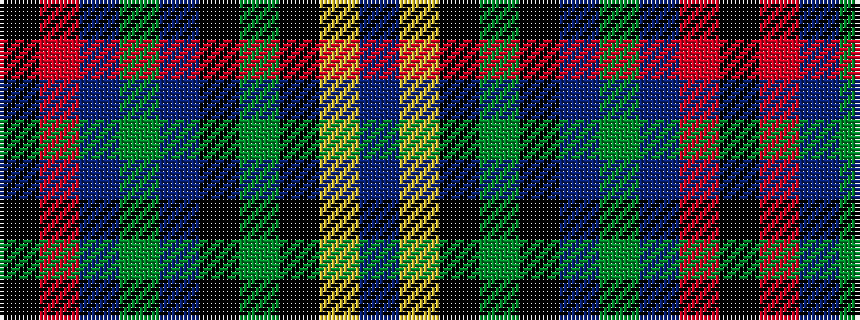

BYKGKBGBRK

It is a 10 stripe tartan.

<figure class="pat-woven">

<figcaption>idealised sample</figcaption>
</figure>

## Colour Sequence



## Tartans with this colour sequence

| Tartans |
|---------------|
| [Kingsbarns Golf Links](/setts/s10/k8r3dt4g4dt48k48g4k4lo3dt8/)|
||
| [Kingsbarns Golf Links](/setts/s10/k8r3b4g4b48k48g4k4ly3b8/)|
||
